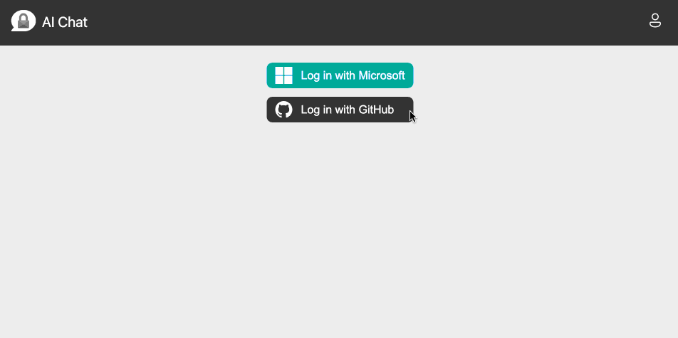
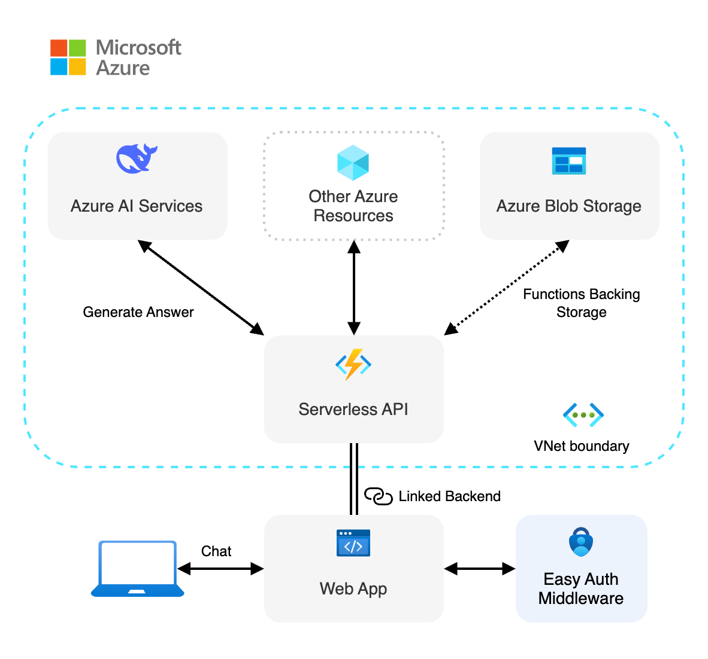
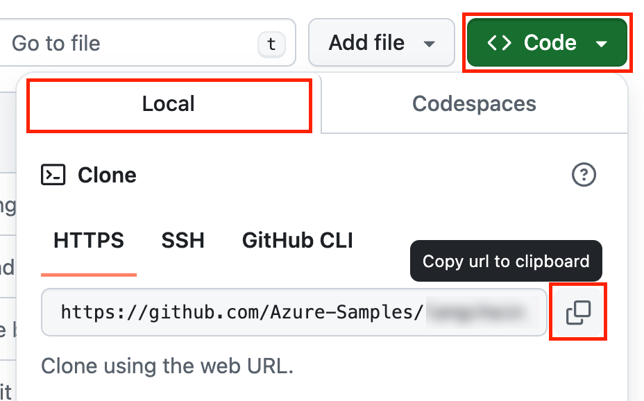
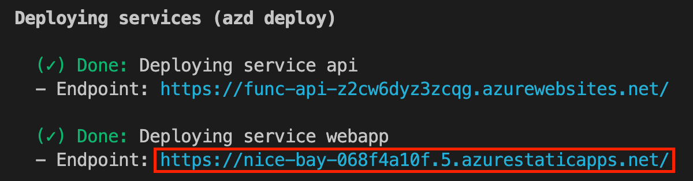

<!-- prettier-ignore -->
<div align="center">


# DeepSeek-R1 JavaScript starter

[](https://codespaces.new/Azure-Samples/deepseek-js?hide_repo_select=true&ref=main&quickstart=true)
[](https://www.youtube.com/playlist?list=PLlrxD0HtieHi5ZpsHULPLxm839IrhmeDk)
[](https://github.com/Azure-Samples/deepseek-js/actions)

[](https://www.typescriptlang.org)
[](LICENSE)

:star: If you like this sample, star it on GitHub — it helps a lot!

[Overview](#overview) • [Get started](#getting-started) • [Run the sample](#run-the-sample) • [Resources](#resources) • [FAQ](#faq) • [Guidance](#guidance)



</div>

This sample shows how to deploy a secure [Azure AI Services](https://learn.microsoft.com/azure/ai-services/what-are-ai-services) infrastructure with DeepSeek-R1 model, along with reusable components to build a web UI with authentication. It provides a starting point for building secure AI chat applications, using [RBAC](https://learn.microsoft.com/azure/role-based-access-control/built-in-roles) permissions and Azure AI Inference SDK with [keyless (Entra) authentication](https://learn.microsoft.com/entra/identity/managed-identities-azure-resources/overview). The backend resources are secured within an [Azure Virtual Network](https://learn.microsoft.com/azure/virtual-network/virtual-networks-overview), and the frontend is hosted on [Azure Static Web Apps](https://learn.microsoft.com/azure/static-web-apps/overview).

> [!NOTE]
> The DeepSeek-R1 model focus is on complex reasoning tasks, and it is not designed for general conversation. It is best suited for tasks that require a deep understanding of the context and a complex reasoning process to provide an answer.
> This also means that you may experience longer response times compared to other models, because it simulates a though process (englobed under the `<think>` tag) before providing an actual answer.

## Overview

Building AI applications can be complex and time-consuming, but using accelerator components with Azure allows to greatly simplify the process. This template provides a starting point for building a secure UI with Azure AI Services, using a keyless authentication mechanism and a virtual network to secure the backend resources. It also demonstrates how to set up user authentication and authorization with configurable providers with [Azure Static Web Apps Easy Auth](https://learn.microsoft.com/azure/static-web-apps/authentication-authorization).

<div align="center">
  
</div>

This application is made from multiple components:

- Reusable and customizable web components built with [Lit](https://lit.dev) handling user authentication and providing an AI chat UI. The code is located in the `packages/ai-chat-components` folder.

- Example web app integrations of the web components, hosted on [Azure Static Web Apps](https://learn.microsoft.com/azure/static-web-apps/overview). There are example using [static HTML](./packages/webapp-html/), [React](./packages/webapp-react/), [Angular](./packages/webapp-angular/), [Vue](./packages/webapp-vue/) and [Svelte](./packages/webapp-svelte/).

- A serverless API built with [Azure Functions](https://learn.microsoft.com/azure/azure-functions/functions-overview?pivots=programming-language-javascript) and using [Azure AI Inference SDK](https://www.npmjs.com/package/@azure-rest/ai-inference) to generate responses to the user chat queries. The code is located in the `packages/api` folder.

We use the [HTTP protocol for AI chat apps](https://aka.ms/chatprotocol) to communicate between the web app and the API.

## Features

- **Secure deployments**: Uses Azure Managed Identity for keyless authentication and Azure Virtual Network to secure the backend resources.
- **Reusable components**: Provides reusable web components for building secure AI chat applications.
- **Serverless Architecture**: Utilizes Azure Functions and Azure Static Web Apps for a fully serverless deployment.
- **Scalable and Cost-Effective**: Leverages Azure's serverless offerings to provide a scalable and cost-effective solution.
- **Local Development**: Supports local development using Ollama for testing without any cloud costs.

## Getting started

There are multiple ways to get started with this project.

The quickest way is to use [GitHub Codespaces](#use-github-codespaces) that provides a preconfigured environment for you. Alternatively, you can [set up your local environment](#use-your-local-environment) following the instructions below.


<details open>
<summary><h3>Use GitHub Codespaces</h3></summary>

You can run this project directly in your browser by using GitHub Codespaces, which will open a web-based VS Code:

[](https://codespaces.new/Azure-Samples/deepseek-js?hide_repo_select=true&ref&quickstart=true)

</details>

<details>
<summary><h3>Use a VSCode dev container</h3></summary>

A similar option to Codespaces is VS Code Dev Containers, that will open the project in your local VS Code instance using the [Dev Containers extension](https://marketplace.visualstudio.com/items?itemName=ms-vscode-remote.remote-containers).

You will also need to have [Docker](https://www.docker.com/get-started/) installed on your machine to run the container.

[](https://vscode.dev/redirect?url=vscode://ms-vscode-remote.remote-containers/cloneInVolume?url=https://github.com/Azure-Samples/deepseek-js)

</details>

<details>
<summary><h3>Use your local environment</h3></summary>

You need to install following tools to work on your local machine:

- [Node.js LTS](https://nodejs.org/en/download)
- [Azure Developer CLI](https://aka.ms/azure-dev/install)
- [Git](https://git-scm.com/downloads)
- [PowerShell 7+](https://github.com/powershell/powershell) _(for Windows users only)_
  - **Important**: Ensure you can run `pwsh.exe` from a PowerShell command. If this fails, you likely need to upgrade PowerShell.
  - Instead of Powershell, you can also use Git Bash or WSL to run the Azure Developer CLI commands.

Then you can get the project code:

1. [**Fork**](https://github.com/Azure-Samples/deepseek-js/fork) the project to create your own copy of this repository.
2. On your forked repository, select the **Code** button, then the **Local** tab, and copy the URL of your forked repository.

   
3. Open a terminal and run this command to clone the repo: `git clone <your-repo-url>`
4. Open the cloned project in your favorite IDE, then run this command in a terminal: `npm install`

</details>

## Run the sample

To run this sample, you first need to provision the Azure resources needed and deploy the sample. After that, you can run the sample locally using the deployed resources.

### Deploy the sample to Azure

#### Azure prerequisites

- **Azure account**. If you're new to Azure, [get an Azure account for free](https://azure.microsoft.com/free) to get free Azure credits to get started. If you're a student, you can also get free credits with [Azure for Students](https://aka.ms/azureforstudents).
- **Azure account permissions**:
  - Your Azure account must have `Microsoft.Authorization/roleAssignments/write` permissions, such as [Role Based Access Control Administrator](https://learn.microsoft.com/azure/role-based-access-control/built-in-roles#role-based-access-control-administrator-preview), [User Access Administrator](https://learn.microsoft.com/azure/role-based-access-control/built-in-roles#user-access-administrator), or [Owner](https://learn.microsoft.com/azure/role-based-access-control/built-in-roles#owner). If you don't have subscription-level permissions, you must be granted [RBAC](https://learn.microsoft.com/azure/role-based-access-control/built-in-roles#role-based-access-control-administrator-preview) for an existing resource group and deploy to that existing group by running these commands:
    ```bash
    azd env set AZURE_RESOURCE_GROUP <name of existing resource group>
    azd env set AZURE_LOCATION <location of existing resource group>
    ```
  - Your Azure account also needs `Microsoft.Resources/deployments/write` permissions on the subscription level.

#### Cost estimation

See the [cost estimation](./docs/cost.md) details for running this sample on Azure.

#### Deploy the sample

1. Open a terminal and navigate to the root of the project.
2. Authenticate with Azure by running `azd auth login`.
3. Run `azd up` to deploy the application to Azure. This will provision Azure resources, deploy this sample, and build the search index based on the files found in the `./data` folder.
   - You will be prompted to select a base location for the resources. If you're unsure of which location to choose, select `eastus2`.
   - By default, the AI Services resource will be deployed to `eastus2`. You can set a different location with `azd env set AZURE_AI_SERVICES_LOCATION <location>`.

The deployment process will take a few minutes. Once it's done, you'll see the URL of the web app in the terminal.

<div align="center">
  
</div>

You can now open the web app in your browser and start chatting with the bot.

#### Clean up

To clean up all the Azure resources created by this sample:

1. Run `azd down --purge`
2. When asked if you are sure you want to continue, enter `y`

The resource group and all the resources will be deleted.

### Run the sample locally

First you need to provision the Azure resources needed to run the sample. Follow the instructions in the [Deploy the sample to Azure](#deploy-the-sample-to-azure) section to deploy the sample to Azure, if you haven't done so already.

Once your deployment is complete, you should see a `.env` file in the `packages/api` folder. This file contains the environment variables needed to run the application using Azure resources.

To run the sample, you can then use the same commands as for the Ollama setup. This will start the web app and the API locally:

```bash
npm start
```

Open the URL `http://localhost:4280` in your browser, use the authentication emulator to connect to the web app, and start chatting with the bot.

## Resources

Here are some resources to learn more about Azure AI Services and related technologies:

- [Serverless AI Chat sample](https://github.com/Azure-Samples/serverless-chat-langchainjs)
- [Generative AI with JavaScript](https://github.com/microsoft/generative-ai-with-javascript)
- [Generative AI For Beginners](https://github.com/microsoft/generative-ai-for-beginners)
- [Chat + Enterprise data with Azure OpenAI and Azure AI Search](https://github.com/Azure-Samples/azure-search-openai-javascript)

You can also find [more Azure AI samples here](https://github.com/Azure-Samples/azureai-samples).

## FAQ

You can find answers to frequently asked questions in the [FAQ](./docs/faq.md).

## Guidance

### Region availability

This template uses model `DeepSeek-R1` which may not be available in all Azure regions. Check for [up-to-date region availability](https://learn.microsoft.com/azure/ai-services/openai/concepts/models#standard-deployment-model-availability) and select a region during deployment accordingly.

We recommend using `East US 2` if you're unsure of which region to choose.

### Security

This template has [Managed Identity](https://learn.microsoft.com/entra/identity/managed-identities-azure-resources/overview) built in to eliminate the need for developers to manage these credentials. Applications can use managed identities to obtain Microsoft Entra tokens without having to handle any secrets in the code. Additionally, we're using [Microsoft Security DevOps GitHub Action](https://github.com/microsoft/security-devops-action) to scan the infrastructure-as-code files and generates a report containing any detected issues.

### Troubleshooting

If you have any issue when running or deploying this sample, please check the [troubleshooting guide](./docs/troubleshooting.md). If you can't find a solution to your problem, please [open an issue](https://github.com/Azure-Samples/deepseek-js/issues) in this repository.

## Contributing

This project welcomes contributions and suggestions. Most contributions require you to agree to a
Contributor License Agreement (CLA) declaring that you have the right to, and actually do, grant us
the rights to use your contribution. For details, visit https://cla.opensource.microsoft.com.

When you submit a pull request, a CLA bot will automatically determine whether you need to provide
a CLA and decorate the PR appropriately (e.g., status check, comment). Simply follow the instructions
provided by the bot. You will only need to do this once across all repos using our CLA.

This project has adopted the [Microsoft Open Source Code of Conduct](https://opensource.microsoft.com/codeofconduct/).
For more information see the [Code of Conduct FAQ](https://opensource.microsoft.com/codeofconduct/faq/) or
contact [opencode@microsoft.com](mailto:opencode@microsoft.com) with any additional questions or comments.

## Trademarks

This project may contain trademarks or logos for projects, products, or services. Authorized use of Microsoft
trademarks or logos is subject to and must follow
[Microsoft's Trademark & Brand Guidelines](https://www.microsoft.com/en-us/legal/intellectualproperty/trademarks/usage/general).
Use of Microsoft trademarks or logos in modified versions of this project must not cause confusion or imply Microsoft sponsorship.
Any use of third-party trademarks or logos are subject to those third-party's policies.
